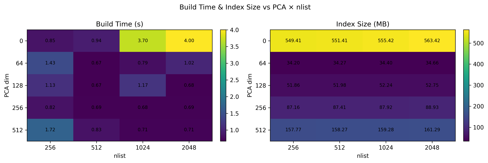
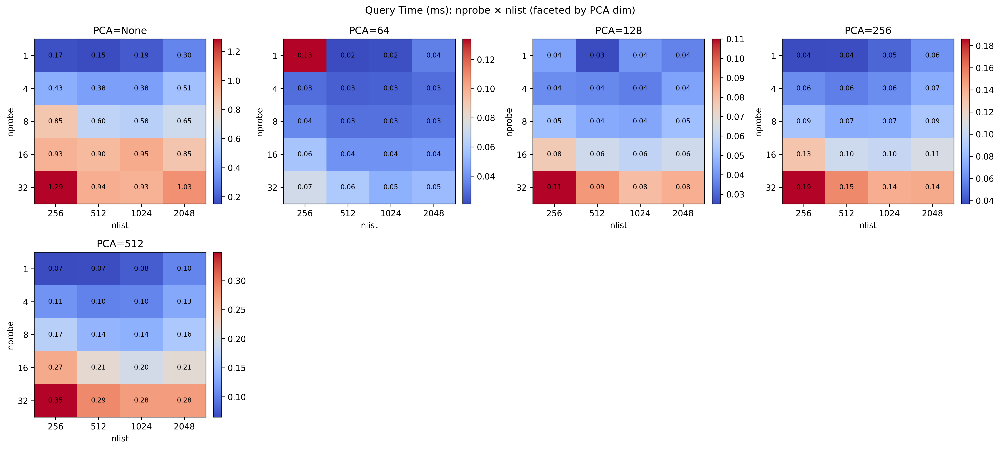
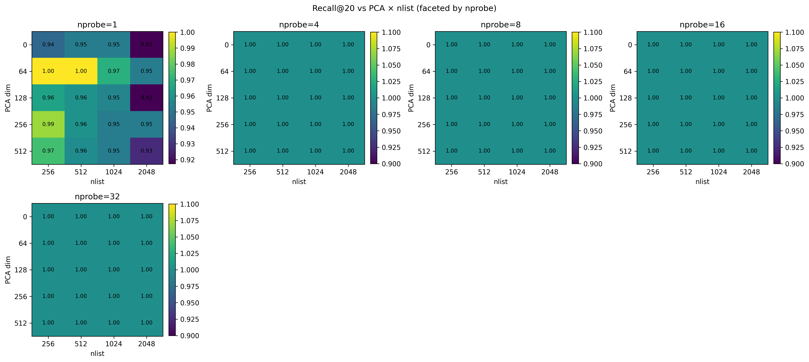

## 一、IVF（Inverted File Index）参数说明

---

### 1. nlist（倒排桶数量）

**含义**：
用于将特征空间划分成多少个聚类桶（cluster centroids）。

**作用机制**：

* 构建阶段使用 K-means 将所有向量聚类为 `nlist` 个中心。
* 每个中心对应一个倒排桶。
* 向量被分配到距离最近的中心。
* 查询时只搜索部分桶（由 `nprobe` 决定）。

**影响**：
增加 `nlist`：
✅ 桶划分更细，搜索更精确
✅ 提升精度上限（Recall 可更高）
❌ 索引训练时间上升（更多聚类中心）
❌ 索引体积和内存开销增加
❌ 小数据集时过大 nlist 会过拟合

**推荐范围**：
≈ √N ～ 4√N
（N 为数据库向量数量，例如 100k 向量 → 300~1200）

---

### 2. nprobe（查询桶数量）

**含义**：
查询时访问的倒排桶个数。

**作用机制**：

* 每次查询先找到最近的 `nprobe` 个聚类中心；
* 然后只在这些桶内搜索候选项；
* 取结果并排序。

**影响**：
增加 `nprobe`：
✅ Recall 提高（覆盖更多区域）
✅ 更接近精确搜索结果
❌ 查询时间线性增加
❌ CPU/GPU 负载更高

**推荐范围**：
1～64
（典型值：4, 8, 16, 32）

---

### 3. pq_m（PQ 子空间数，可选）

**含义**：
用于 Product Quantization（向量压缩）的分块数。

**作用机制**：

* 将特征向量分成 `m` 个子空间；
* 每个子空间独立量化成离散码；
* 查询时用查表计算近似距离。

**影响**：
增加 `pq_m`：
✅ 精度提高（更细分量化）
❌ 内存和索引大小上升
❌ 训练时间增加

**推荐范围**：
16、32、64（视维度而定，一般维度/m ≈ 8~16）

---

### 4. pca_dim（PCA降维维度，可选）

**含义**：
在索引前先使用 PCA 降维。

**作用机制**：
减少向量维度，压缩数据并去除噪声，提升搜索速度。

**影响**：
减少 `pca_dim`：
✅ 训练/查询更快
✅ 内存与索引更小
❌ Recall 降低（信息损失）

**推荐范围**：
64、128、256
（取原维度的 1/2～1/4）

---

## 🧠 二、HNSW（Hierarchical Navigable Small World Graph）参数说明

---

### 1. M（每个节点的邻居数）

**含义**：
图中每个节点平均连接的邻居数量。

**作用机制**：

* 控制图的稠密程度；
* 每个节点与 `M` 个最近的节点建立连接；
* 查询时从入口节点开始沿边遍历。

**影响**：
增加 `M`：
✅ 提升 Recall（图更稠密，更易找到近邻）
✅ 提升搜索稳定性
❌ 内存占用线性增加（每个节点更多边）
❌ 构建时间上升

**推荐范围**：
8～64（常用 16、32）

---

### 2. efConstruction（构建时候选集大小）

**含义**：
索引构建时，每个新节点在插入图中时考虑的候选邻居数量。

**作用机制**：

* 控制构图时的近似度；
* 大的 `efConstruction` 意味着更精确的连接。

**影响**：
增加 `efConstruction`：
✅ 构建出的图更准确（更高 Recall）
❌ 构建时间显著上升
❌ 内存占用略增

**推荐范围**：
100～400（取决于数据量和维度）

---

### 3. efSearch（查询时候选集大小）

**含义**：
搜索时维护的候选节点数量。

**作用机制**：

* 搜索从入口点开始，维持一个候选优先队列（大小为 `efSearch`）；
* 值越大，遍历越多节点，结果越接近真实最近邻。

**影响**：
增加 `efSearch`：
✅ Recall 提高
❌ 查询时间线性增加

**推荐范围**：
50～200（常用 64, 128）

------
## Grid Search结果

### IVF Index Grid Search

三个Hyper parameter中只有nlist和PCA Dimension会对训练时间，即Build Time产生影响，因为nprobe是运行时的查询参数。

其中 PCA 0即为不进行PCA压缩。

明显可以发现PCA压缩对训练时间和Index大小都有正向优化作用，nlist对Build Time的影响较为混合，但是会略微对内存大小产生负面影响，可以考虑为
额外的聚类和标记产生了一定数据量，但不显著。PCA压缩可以极大，且基本线性减少内存大小，考虑到其是将每个向量的维度进行压缩，这样的结果符合预期。
------

关于请求时间，由于nprob参数决定运行时进行搜索的cluster数量，其越大即会增加需要搜索的向量数量，继而对运行时间产生负面影响。
同一nprob下更大的nlist会产生更细的切分进而减少搜索时间，但是注意到向下对角线方向，即nprob*nlist相等的方向随着nlist增加搜索时间会相对增加，
虽然表面上进行比对的向量接近，但更多的nlist，即cluster会增加I/O开销及有更多的稀疏向量需要比对，进而实际上增加了query time。
---

在我们的数据集下recall@20（基于label）基本都可以达到100%，影响不显著，但在nprob=，即只搜索一个cluster情况下注意到了recall的下降。说明PCA压缩和cluster划分增加
会在recall和精确度上产生负面影响的tradeoff。但是由于我们的数据集较小，我们对原数据进行较大的压缩仍然能获得较好的结果。虽然没有呈现，但是基于
完全精确的向量匹配的recall，各种压缩下均不能做到100%。但是由于本任务不要求此种精确匹配故不在优化的范围内。